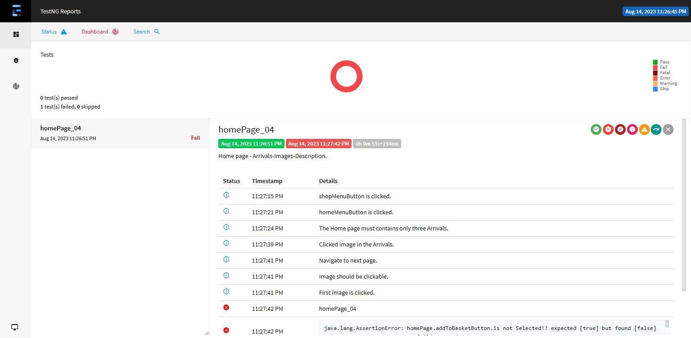

Site to be tested:  http://practice.automationtesting.in/

<h2>HOME PAGE</h2>

-------------------------------------
<h4>1. Home Page with three Sliders only</h4>

1) Open the browser
2) Enter the URL “http://practice.automationtesting.in/”
3) Click on Shop Menu
4) Now click on Home menu button
5) Test whether the Home page has Three Sliders only
6) The Home page must contains only three sliders
   report-> 

--------------------------------------
<h4>2. Home page with three Arrivals only</h4>

1) Open the browser
2) Enter the URL “http://practice.automationtesting.in/”
3) Click on Shop Menu
4) Now click on Home menu button
5) Test whether the Home page has Three Arrivals only
6) The Home page must contains only three Arrivals
   report-> 

-------------------------------------------------
<h4>3. Home page - Images in Arrivals should navigate</h4>

1) Open the browser
2) Enter the URL “http://practice.automationtesting.in/”
3) Click on Shop Menu
4) Now click on Home menu button
5) Test whether the Home page has Three Arrivals only
6) The Home page must contains only three Arrivals
7) Now click the image in the Arrivals
8) Test whether it is navigating to next page where the user can add that book into his basket.
9) Image should be clickable and shoul navigate to next page where user can add that book to his basket
    report-> 

-------------------------------------------
<h4>4. Home page - Arrivals-Images-Description</h4>

1) Open the browser
2) Enter the URL “http://practice.automationtesting.in/”
3) Click on Shop Menu
4) Now click on Home menu button
5) Test whether the Home page has Three Arrivals only
6) The Home page must contains only three Arrivals
7) Now click the image in the Arrivals
8) Test whether it is navigating to next page where the user can add that book into his basket.
9) Image should be clickable and shoul navigate to next page where user can add that book to his basket
10) Click on Description tab for the book you clicked on.
11) There should be a description regarding that book the user clicked on
    report-> 

---------------------------------------
<h4>5. Home page - Arrivals-Images-Reviews</h4>

1) Open the browser
2) Enter the URL “http://practice.automationtesting.in/”
3) Click on Shop Menu
4) Now click on Home menu button
5) Test whether the Home page has Three Arrivals only
6) The Home page must contains only three Arrivals
7) Now click the image in the Arrivals
8) Test whether it is navigating to next page where the user can add that book into his basket.
9) Image should be clickable and shoul navigate to next page where user can add that book to his basket
10) Now clock on Reviews tab for the book you clicked on.
11) There should be a Reviews regarding that book the user clicked on
    report-> 

---------------------------------------------
<h4>6. Home page - Arrivals-Images-Add to Basket</h4>

1) Open the browser
2) Enter the URL “http://practice.automationtesting.in/”
3) Click on Shop Menu
4) Now click on Home menu button
5) Test whether the Home page has Three Arrivals only
6) The Home page must contains only three Arrivals
7) Now click the image in the Arrivals
8) Test whether it is navigating to next page where the user can add that book into his basket.
9) Image should be clickable and shoul navigate to next page where user can add that book to his basket
10) Click on the Add To Basket button which adds that book to your basket
11) User can view that Book in the Menu item with price.
12) User can add a book by clicking on Add To Basket button which adds that book in to his Basket
    report-> 

------------------------------------------------------
<h4>7. Home page - Arrivals-Add to Basket with more books</h4>

1) Open the browser
2) Enter the URL “http://practice.automationtesting.in/”
3) Click on Shop Menu
4) Now click on Home menu button
5) Test whether the Home page has Three Arrivals only
6) The Home page must contains only three Arrivals
7) Now click the image in the Arrivals
8) Test whether it is navigating to next page where the user can add that book into his basket.
9) Image should be clickable and shoul navigate to next page where user can add that book to his basket
10) Click on the Add To Basket button which adds that book to your basket
11) User can view that Book in the Menu item with price.
12) User can add a book by clicking on Add To Basket button which adds that book in to his Basket
13) Select more books than the books in stock.Ex if the stock has 20 books, try to add 21.
14) Click the add to basket button
15) Now it throws an error prompt like you must enter a value between 1 and 20
   report-> 

--------------------------------------
<h4>8. Home-Arrivals-Add to Basket-Items</h4>

1) Open the browser
2) Enter the URL “http://practice.automationtesting.in/”
3) Click on Shop Menu
4) Now click on Home menu button
5) Test whether the Home page has Three Arrivals only
6) The Home page must contains only three Arrivals
7) Now click the image in the Arrivals
8) Test whether it is navigating to next page where the user can add that book into his basket.
9) Image should be clickable and shoul navigate to next page where user can add that book to his basket
10) Click on the Add To Basket button which adds that book to your basket
11) User can view that Book in the Menu item with price.
12) Now click on Item link which navigates to proceed to check out page.
13) User can click on the Item link in menu item after adding the book in to the basket which leads to the check out page
    report-> 

--------------------------------------------
<h4>9. Home-Arrivals-Add to Basket-Items-Coupon</h4>

1) Open the browser
2) Enter the URL “http://practice.automationtesting.in/”
3) Click on Shop Menu
4) Now click on Home menu button
5) Test whether the Home page has Three Arrivals only
6) The Home page must contains only three Arrivals
7) Now click the image in the Arrivals
8) Test whether it is navigating to next page where the user can add that book into his basket.
9) Image should be clickable and shoul navigate to next page where user can add that book to his basket
10) Click on the Add To Basket button which adds that book to your basket
11) User can view that Book in the Menu item with price.
12) Now click on Item link which navigates to proceed to check out page.
13) User can click on the Item link in menu item after adding the book in to the basket which leads to the check out page
14) Enter the Coupon code as ‘krishnasakinala’ to get 50rps off on the total.
15) User can able to apply coupon by entering ‘krishnasakinala’ in the coupon textbox which give 50rps off on the total price
    report-> 

------------------------------------------------------
<h4>10. Home-Arrivals-Add to Basket-Items-Coupon value<450</h4>

1) Open the browser
2) Enter the URL “http://practice.automationtesting.in/”
3) Click on Shop Menu
4) Now click on Home menu button
5) Test whether the Home page has Three Arrivals only
6) The Home page must contains only three Arrivals
7) Now click the image in the Arrivals
8) Test whether it is navigating to next page where the user can add that book into his basket.
9) Image should be clickable and shoul navigate to next page where user can add that book to his basket
10) Click on the Add To Basket button which adds that book to your basket
11) User can view that Book in the Menu item with price.
12) Now click on Item link which navigates to proceed to check out page.
13) User can click on the Item link in menu item after adding the book in to the basket which leads to the check out page
14) Enter the Coupon code as ‘krishnasakinala’ to get 50rps off on the total.
15) User can not able to apply coupon by entering ‘krishnasakinala’ in the coupon textbox which give 50rps off on the total price
because the coupon is applicable for the book price > 450 rps
   report->  

--------------------------------------------------
<h4>11. Home-Arrivals-Add to Basket-Items-Remove book</h4>

1) Open the browser
2) Enter the URL “http://practice.automationtesting.in/”
3) Click on Shop Menu
4) Now click on Home menu button
5) Test whether the Home page has Three Arrivals only
6) The Home page must contains only three Arrivals
7) Now click the image in the Arrivals
8) Test whether it is navigating to next page where the user can add that book into his basket.
9) Image should be clickable and shoul navigate to next page where user can add that book to his basket
10) Click on the Add To Basket button which adds that book to your basket
11) User can view that Book in the Menu item with price.
12) Now click on Item link which navigates to proceed to check out page.
13) Now click on Remove this icon in Check out page which removes that book from the grid.
14) User has the feasibility to remove the book at the time of check out also
    report->  

-----------------------------------------------
<h4>12. Home-Arrivals-Add to Basket-Items-Add book</h4>
   
1) Open the browser
2) Enter the URL “http://practice.automationtesting.in/”
3) Click on Shop Menu
4) Now click on Home menu button
5) Test whether the Home page has Three Arrivals only
6) The Home page must contains only three Arrivals
7) Now click the image in the Arrivals
8) Test whether it is navigating to next page where the user can add that book into his basket.
9) Image should be clickable and shoul navigate to next page where user can add that book to his basket
10) Click on the Add To Basket button which adds that book to your basket
11) User can view that Book in the Menu item with price.
12) Now click on Item link which navigates to proceed to check out page.
13) Click on textbox value under quantity in Check out page to add or subtract books.
14) Now after the above change ‘Update Basket’ button will turn into Clickable mode.
15) Now click on Update Basket to reflect those changes
16) User has the feasibility to Update Basket at the time of check out.
    report->  

-----------------------------------------------------------------
<h4>13. Home-Arrivals-Add to Basket-Items-Check-out-Book Final price</h4>

1) Open the browser
2) Enter the URL “http://practice.automationtesting.in/”
3) Click on Shop Menu
4) Now click on Home menu button
5) Test whether the Home page has Three Arrivals only
6) The Home page must contains only three Arrivals
7) Now click the image in the Arrivals
8) Test whether it is navigating to next page where the user can add that book into his basket.
9) Image should be clickable and shoul navigate to next page where user can add that book to his basket
10) Click on the Add To Basket button which adds that book to your basket
11) User can view that Book in the Menu item with price.
12) Now click on Item link which navigates to proceed to check out page.
13) Now User can find the Total price of the book in the Check out grid.
14) User has the feasibility to find the total price of the books at to find the total price of the books at the time of check out
    report->  

--------------------------------------------------------------
<h4>14. Home-Arrivals-Add to Basket-Items-Check-out-Update Basket</h4>

1) Open the browser
2) Enter the URL “http://practice.automationtesting.in/”
3) Click on Shop Menu
4) Now click on Home menu button
5) Test whether the Home page has Three Arrivals only
6) The Home page must contains only three Arrivals
7) Now click the image in the Arrivals
8) Test whether it is navigating to next page where the user can add that book into his basket.
9) Image should be clickable and shoul navigate to next page where user can add that book to his basket
10) Click on the Add To Basket button which adds that book to your basket
11) User can view that Book in the Menu item with price.
12) Now click on Item link which navigates to proceed to check out page.
13) Click on textbox value under quantity in Check out page to add or subtract books.
14) Now after the above change ‘Update Basket’ button will turn into Clickable mode.
15) Now click on Update Basket to reflect those changes
16) User has the feasibility to Update Basket at the time of check out
    report->  

----------------------------------------------------------------------------
<h4>15. Home-Arrivals-Add to Basket-Items-Check-out-Total & Sub-total condition</h4>

1) Open the browser
2) Enter the URL “http://practice.automationtesting.in/”
3) Click on Shop Menu
4) Now click on Home menu button
5) Test whether the Home page has Three Arrivals only
6) The Home page must contains only three Arrivals
7) Now click the image in the Arrivals
8) Test whether it is navigating to next page where the user can add that book into his basket.
9) Image should be clickable and shoul navigate to next page where user can add that book to his basket
10) Click on the Add To Basket button which adds that book to your basket
11) User can view that Book in the Menu item with price.
12) Now click on Item link which navigates to proceed to check out page.
13) Now user can find total and subtotal values just above the Proceed to Checkout button.
14) The total always < subtotal because taxes are added in the subtotal
15) Total
    report->  

--------------------------------------------------------------
<h4>16. Home-Arrivals-Add to Basket-Items-Check-out functionality</h4>

1) Open the browser
2) Enter the URL “http://practice.automationtesting.in/”
3) Click on Shop Menu
4) Now click on Home menu button
5) Test whether the Home page has Three Arrivals only
6) The Home page must contains only three Arrivals
7) Now click the image in the Arrivals
8) Test whether it is navigating to next page where the user can add that book into his basket.
9) Image should be clickable and shoul navigate to next page where user can add that book to his basket
10) Click on the Add To Basket button which adds that book to your basket
11) User can view that Book in the Menu item with price.
12) Now click on Item link which navigates to proceed to check out page.
13) Now user can find total and subtotal values just above the Proceed to Checkout button.
14) The total always < subtotal because taxes are added in the subtotal
15) Now click on Proceed to Check out button which navigates to payment gateway page.
16) Clicking on Proceed to Checkout button leads to payment gateway page
17)Clicking on Proceed to Checkout button leads to payment gateway page
   report->  

----------------------------------------------------------------
<h4>17. Home-Arrivals-Add to Basket-Items-Check-out-Payment Gateway</h4>

1) Open the browser
2) Enter the URL “http://practice.automationtesting.in/”
3) Click on Shop Menu
4) Now click on Home menu button
5) Test whether the Home page has Three Arrivals only
6) The Home page must contains only three Arrivals
7) Now click the image in the Arrivals
8) Test whether it is navigating to next page where the user can add that book into his basket.
9) Image should be clickable and shoul navigate to next page where user can add that book to his basket
10) Click on the Add To Basket button which adds that book to your basket
11) User can view that Book in the Menu item with price.
12) Now click on Item link which navigates to proceed to check out page.
13)Now user can find total and subtotal values just above the Proceed to Checkout button.
14)The total always < subtotal because taxes are added in the subtotal
15)Now click on Proceed to Check out button which navigates to payment gateway page.
16)User can view Billing Details,Order Details,Additional details and Payment gateway details.
17)Now user can fill his details in billing details form and can opt any payment in the payment gateway like Direct bank transfer,cheque,cash or paypal.
18)User has the feasibility to add coupon in the payment gateway page and also he can find billing,order and additional details.
   report->  

----------------------------------------------------------------------------
<h4>18. Home-Arrivals-Add to Basket-Items-Check-out-Payment Gateway-Place order</h4>

1) Open the browser
2) Enter the URL “http://practice.automationtesting.in/”
3) Click on Shop Menu
4) Now click on Home menu button
5) Test whether the Home page has Three Arrivals only
6) The Home page must contains only three Arrivals
7) Now click the image in the Arrivals
8) Test whether it is navigating to next page where the user can add that book into his basket.
9) Image should be clickable and shoul navigate to next page where user can add that book to his basket
10) Click on the Add To Basket button which adds that book to your basket
11) User can view that Book in the Menu item with price.
12) Now click on Item link which navigates to proceed to check out page.
13) Now user can find total and subtotal values just above the Proceed to Checkout button.
14) The total always < subtotal because taxes are added in the subtotal>
15) Now click on Proceed to Check out button which navigates to payment gateway page.
16) User can view Billing Details,Order Details,Additional details and Payment gateway details.
17) Now user can fill his details in billing details form and can opt any payment in the payment gateway like Direct bank transfer,cheque,cash or paypal.
18) Now click on Place Order button to complete process
19) On clicking place-order button user completes the process where the page navigates to Order confirmation page
with order details,bank details,customer details and billing details.
   report->   

<h2>MY ACCOUNT - LOGIN</h2>

---------------------------------------------
<h4>19. Log-in with valid username and password</h4>

1) Open the browser
2) Enter the URL “http://practice.automationtesting.in/”
3) Click on My Account Menu
4) Enter registered username in username textbox
5) Enter password in password textbox
6) Click on login button
7) User must successfully login to the web page
   report->   

---------------------------------------------------------
<h4>20. Log-in with incorrect username and incorrect password</h4>

1) Open the browser
2) Enter the URL “http://practice.automationtesting.in/”
3) Click on My Account Menu
4) Enter incorrect username in username textbox
5) Enter incorrect password in password textbox.
6) Click on login button
7) Proper error must be displayed(ie Invalid username) and prompt to enter login again
   report->   

---------------------------------------------------
<h4>21. Log-in with correct username and empty password</h4>

1) Open the browser
2) Enter the URL “http://practice.automationtesting.in/”
3) Click on My Account Menu
4) Enter valid username in username textbox
5) Now enter empty password in the password textbox
6) Click on login button.
7) Proper error must be displayed(ie Invalid password) and prompt to enter login again
   report->  
 
-------------------------------------------------
<h4>22. Log-in with empty username and valid password</h4>

1) Open the browser
2) Enter the URL “http://practice.automationtesting.in/”
3) Click on My Account Menu
4) Enter empty username in username textbox
5) Now enter valid password in the password textbox
6) Click on login button.
7) Proper error must be displayed(ie Invalid username) and prompt to enter login again
   report->  

-------------------------------------------------
<h4>23. Log-in with empty username and empty password</h4>

1) Open the browser
2) Enter the URL “http://practice.automationtesting.in/”
3) Click on My Account Menu
4) Enter empty username in username textbox
5) Now enter valid password in the password textbox
6) Click on login button.
7) Proper error must be displayed(ie required username) and prompt to enter login again
   report->   

-------------------------------------
<h4>24. Log-in -Password should be masked</h4>

1) Open the browser
2) Enter the URL “http://practice.automationtesting.in/”
3) Click on My Account Menu
4) Enter the password field with some characters.
5) The password field should display the characters in asterisks or bullets such that the password is not visible on the screen
   report->   

--------------------------------
<h4>25. Login-Handles case sensitive</h4>

1) Open the browser
2) Enter the URL “http://practice.automationtesting.in/”
3) Click on My Account Menu
4) Enter the case changed username in username textbox
5) Enter the case changed password in the password textbox
6) Now click on login button
7) Login must fail saying incorrect username/password.
   report->   

------------------------
<h4>26. Login-Authentication</h4>

1) Open the browser
2) Enter the URL “http://practice.automationtesting.in/”
3) Click on My Account Menu
4) Enter the case changed username in username textbox
5) Enter the case changed password in the password textbox
6) Now click on login button
7) Once your are logged in, sign out of the site
8) Now press back button
9) User shouldn’t be signed in to his account rather a general webpage must be visible
   report->  

<h2>MY ACCOUNT - REGISTRATION</h2>

------------------------
<h4>27. Registration-Sign-in</h4>

1) Open the browser
2) Enter the URL “http://practice.automationtesting.in/”
3) Click on My Account Menu
4) Enter registered Email Address in Email-Address textbox
5) Enter your own password in password textbox
6) Click on Register button
7) User will be registered successfully and will be navigated to the Home page
   report->  

--------------------------------------
<h4>28. Registration with invalid Email-id</h4>

1) Open the browser
2) Enter the URL “http://practice.automationtesting.in/”
3) Click on My Account Menu
4) Enter invalid Email Address in Email-Address textbox
5) Enter your own password in password textbox
6) Click on Register button
7) Registration must fail with a warning message(ie You must enter a valid email address)
   report->  

------------------------------------
<h4>29. Registration with empty Email-id</h4>

1) Open the browser
2) Enter the URL “http://practice.automationtesting.in/”
3) Click on My Account Menu
4) Enter empty Email Address in Email-Address textbox
5) Enter your own password in password textbox
6) Click on Register button
7) Registration must fail with a warning message(ie please provide valid email address)
   report->  

------------------------------------
<h4>30. Registration with empty password</h4>

1) Open the browser
2) Enter the URL “http://practice.automationtesting.in/”
3) Click on My Account Menu
4) Enter valid Email Address in Email-Address textbox
5) Enter empty password in password textbox
6) Click on Register button
7) Registration must fail with a warning message(ie please enter an account password)
   report->  

-----------------------------------------------
<h4>31. Registration with empty Email-id & password</h4>

1) Open the browser
2) Enter the URL “http://practice.automationtesting.in/”
3) Click on My Account Menu
4) Enter empty Email Address in Email-Address textbox
5) Enter empty password in password textbox
6) Click on Register button
7) Registration must fail with a warning message(ie please provide valid email address)
   report->   

<h2>SHOP</h2>

--------------------------------------
<h4>32. Shop-Filter By Price Functionality</h4>

1) Open the browser
2) Enter the URL “http://practice.automationtesting.in/”
3) Click on Shop Menu
4) Adjust the filter by price between 150 to 450 rps
5) Now click on Filter button
6) User can view books only between 150 to 450 rps price
   report->  

-----------------------------------------
<h4>33. Shop-Product Categories Functionality</h4>

1) Open the browser
2) Enter the URL “http://practice.automationtesting.in/”
3) Click on Shop Menu
4) Click any of the product links available in the product category
5) Now user can view only that particular product
   report->  

--------------------------------------
<h4>34. Shop-Default Sorting Functionality</h4>

1) Open the browser
2) Enter the URL “http://practice.automationtesting.in/”
3) Click on Shop Menu
4) Click on Sort by Popularity item in Default sorting dropdown
5) Now user can view the popular products only
   report->   

--------------------------------------
<h4>35. Shop-Default Sorting Functionality</h4>

1) Open the browser
2) Enter the URL “http://practice.automationtesting.in/”
3) Click on Shop Menu
4) Click on Sort by Average ratings in Default sorting dropdown
5) Now user can view the popular products only
   report->  

--------------------------------------
<h4>36. Shop-Default Sorting Functionality</h4>

1) Open the browser
2) Enter the URL “http://practice.automationtesting.in/”
3) Click on Shop Menu
4) Click on Sort by Newness ratings in Default sorting dropdown
5) Now user can view the popular products only
   report->  

--------------------------------------
<h4>37. Shop-Default Sorting Functionality</h4>

1) Open the browser
2) Enter the URL “http://practice.automationtesting.in/”
3) Click on Shop Menu
4) Click on Sort by Low to High Item in Default sorting dropdown
5) Now user can view the popular products only
   report->  

--------------------------------------
<h4>38. Shop-Default Sorting Functionality</h4>

1) Open the browser
2) Enter the URL “http://practice.automationtesting.in/”
3) Click on Shop Menu
4) Click on Sort by High to Low Item in Default sorting dropdown
5) Now user can view the popular products only
   report->   

--------------------------------
<h4>39. Shop-Read More Functionality</h4>

1) Open the browser
2) Enter the URL “http://practice.automationtesting.in/”
3) Click on Shop Menu
4) Click on read more button in home page
5) Read More option indicates the Out Of Stock.
6) Users cannot add the product which has read more options as it was out of stock.
   report->   

---------------------------
<h4>40. Shop-Sale Functionality</h4>

1) Open the browser
2) Enter the URL “http://practice.automationtesting.in/”
3) Click on Shop Menu
4) Click on Sale written product in home page
5) User can clearly view the actual price with old price stricken for the sale written products
  report->   

------------------------------------------------
<h4>41. Shop-Add to Basket-View Basket Functionality</h4>

1) Open the browser
2) Enter the URL “http://practice.automationtesting.in/”
3) Click on Shop Menu
4) Click on the Add To Basket button which adds that book to your basket
5) User can view that Book in the Menu item with price .
6) Now click on View Basket link which navigates to proceed to check out page.
7) Now user can find total and subtotal values just above the Proceed to Checkout button.
8) The total always < subtotal because taxes are added in the subtotal
9) Now click on Proceed to Check out button which navigates to payment gateway page.
10) User can view Billing Details,Order Details,Additional details and Payment gateway details.
11) Now user can fill his details in billing details form and can opt any payment in the payment gateway like Direct bank transfer,cheque,cash or paypal.
12) Now click on Place Order button to complete process
13) On clicking place order button user completes his process where the page navigates to Order confirmation page with order details,bank details,customer details and billing details.
    report->   

----------------------------------------------------
<h4>42. Shop-Add to Basket-View Basket through Item link</h4> 

1) Open the browser
2) Enter the URL “http://practice.automationtesting.in/”
3) Click on Shop Menu
4) Click on the Add To Basket button which adds that book to your basket
5) User can view that Book in the Menu item with price .
6) Now click on Item link which navigates to proceed to check out page.
7) Now user can find total and subtotal values just above the Proceed to Checkout button.
8) The total always < subtotal because taxes are added in the subtotal
9) Now click on Proceed to Check out button which navigates to payment gateway page.
10) User can view Billing Details,Order Details,Additional details and Payment gateway details.
11) Now user can fill his details in billing details form and can opt any payment in the payment gateway like Direct bank transfer,cheque,cash or paypal.
12) Now click on Place Order button to complete process
13) On clicking place order button user completes his process where the page navigates to Order confirmation page
with order details,bank details,customer details and billing details
    report->   

----------------------------------------------------
<h4>43. Shop-Add to Basket-View Basket-Tax Functionality</h4>

1) Open the browser
2) Enter the URL “http://practice.automationtesting.in/”
3) Click on Shop Menu
4) Click on the Add To Basket button which adds that book to your basket
5) User can view that Book in the Menu item with price .
6) Now click on Item link which navigates to proceed to check out page.
7) Now user can find total and subtotal values just above the Proceed to Checkout button.
8) The total always < subtotal because taxes are added in the subtotal
9) The tax rate variers for India compared to other countries
10) Tax rate for indian should be 2% and for abroad it should be 5%
    report->   

<h2>MY ACCOUNT</h2>

---------------------------
<h4>44. My Accounts - Dashboard</h4>

1) Open the browser
2) Enter the URL “http://practice.automationtesting.in/”
3) Click on My Account Menu
4) Enter registered username in username textbox
5) Enter password in password textbox
6) Click on login button
7) User must successfully login to the web page
8) Click on Myaccount link which leads to Dashboard
9) User must view Dashboard of the site
   report->   

------------------------
<h4>45. My Accounts - Orders</h4>

1) Open the browser
2) Enter the URL “http://practice.automationtesting.in/”
3) Click on My Account Menu
4) Enter registered username in username textbox
5) Enter password in password textbox
6) Click on login button
7) User must successfully login to the web page
8) Click on My account link
9) Click on Orders link
10) User must view their orders on clicking orders link
    report->  

------------------------
<h4>46. My Accounts - Orders</h4> 

1) Open the browser
2) Enter the URL “http://practice.automationtesting.in/”
3) Click on My Account Menu
4) Enter registered username in username textbox
5) Enter password in password textbox
6) Click on login button
7) User must successfully login to the web page
8) Click on My account link
9) Click on Orders link
10) Click view button
11) User must view his Order details,customer details and billing details on clicking view button
    report-> 

-------------------------
<h4>47.  My Accounts - Orders</h4>

1) Open the browser
2) Enter the URL “http://practice.automationtesting.in/”
3) Click on My Account Menu
4) Enter registered username in username textbox
5) Enter password in password textbox
6) Click on login button
7) User must successfully login to the web page
8) Click on My account link
9) Click on Orders link
10) Click view button
11) User must view Order Number Ordered date and Status of the order on clicking view button
    report->   

-------------------------------------
<h4>48. My Accounts-Address Functionality</h4>

1) Open the browser
2) Enter the URL “http://practice.automationtesting.in/”
3) Click on My Account Menu
4) Enter registered username in username textbox
5) Enter password in password textbox
6) Click on login button
7) User must successfully login to the web page
8) Click on My account link which leads to Dashboard
9) Click on Address link
10) User must view billing address and ship address
    report->   

-------------------------------------
<h4>49. My Accounts-Address Functionality</h4>

1) Open the browser
2) Enter the URL “http://practice.automationtesting.in/”
3) Click on My Account Menu
4) Enter registered username in username textbox
5) Enter password in password textbox
6) Click on login button
7) User must successfully login to the web page
8) Click on My account link
9) Click on Address link
10) Click Edit on Shipping Address
11) User can Edit Shipping address
    report->   

-------------------------------
<h4>50. My Accounts-Account Details</h4>

1) Open the browser
2) Enter the URL “http://practice.automationtesting.in/”
3) Click on My Account Menu
4) Enter registered username in username textbox
5) Enter password in password textbox
6) Click on login button
7) User must successfully login to the web page
8) Click on My account link
9) Click on Account details
10) User can view account details where he can change his password also.
    report->   

-----------------------
<h4>51. My Accounts-Log-Out</h4>

1) Open the browser
2) Enter the URL “http://practice.automationtesting.in/”
3) Click on My Account Menu
4) Enter registered username in username textbox
5) Enter password in password textbox
6) Click on login button
7) User must successfully login to the web page
8) Click on My Account link
9) Click on Logout button
10) On clicking logout,User successfully comes out from the site
    report->  
